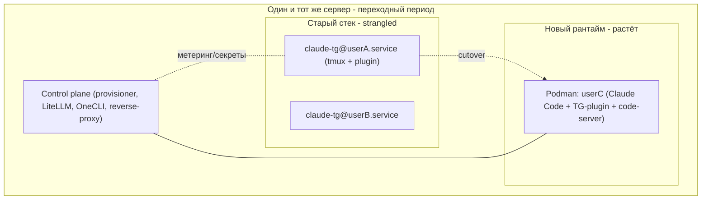
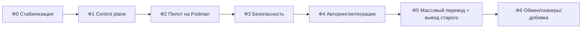

# 02 — Стратегия и фазы миграции

## Стратегия: in-place strangler, per-user cutover
Перестраиваем тот же сервер постепенно, «обвивая» старый стек новым (strangler fig). Новый рантайм поднимается **рядом** со старым; пользователи переводятся **по одному**; не переведённые продолжают работать на старом `claude-tg@<user>.service`. Откат доступен на каждом шаге.

Ключ к бесшовности: **bot-токен пользователя не меняется**. Cutover — это передача права поллинга токена от старого процесса новому в коротком окне (Telegram буферизует входящие). Для пользователя — «тот же бот», без пересоздания и потери истории пейринга.

## Фазы

### Фаза 0 — Стабилизация (на старом стеке)
Хотфиксы текущих проблем без архитектурных изменений. Детали — [01-stabilization-hotfixes.md](01-stabilization-hotfixes.md). Выход: предсказуемый, не «текущий» прод.

### Фаза 1 — Control plane рядом (без влияния на пользователей)
Поднять управляющие сервисы, не трогая работающих ботов:
- **LiteLLM-гейтвей** в текущем режиме доступа (pluggable); пока в режиме теней/метеринга (сборка — [08](08-runtime-and-gateways.md)). **Перед Фазой 2 — блокирующий спайк:** доказать маршрут подписочного OAuth-seat через LiteLLM с per-user метерингом (несущий риск; критерий go/fallback — [08](08-runtime-and-gateways.md)).
- **OneCLI-гейтвей** + хранилище секретов (наполняется в Фазе секретов).
- **Reverse-proxy** и заготовка под Mini App/web-IDE.
- **Append-only аудит-коллектор**.
- Реестр rootless-Podman образа пользователя (Claude Code + официальный TG-плагин + Bun + tmux + code-server + locked-хуки).
Выход: новая плоскость готова принимать первого пользователя.

### Фаза 2 — Пилот: первый пользователь на Podman
Перевести 1 «дружелюбного» пользователя на контейнерный рантайм по runbook ([05](05-seamless-cutover-runbook.md)):
- rootless-Podman + OS-учётка + эластичные лимиты (`MemoryMax` + `CPUWeight`/`IOWeight`) + nftables egress.
- Контекст: **разовый сидинг** хвоста старого tmux-лога на первом старте, далее — нативный `--resume`/`--continue` (старые `session_*.txt` не resumable напрямую).
- Telegram-канал — официальный плагин остаётся ребёнком основной сессии `claude`; надзор = watchdog рестартит юнит; от `claude -p` развязываемся **предотвращением** (см. [01](01-stabilization-hotfixes.md)). tmux в образе сохраняется (нужен плагину для FSM/квисценса/логов).
- Доступ к модели — через LiteLLM; секреты — через OneCLI. `--remote-control` убирается, его роль берёт web-IDE.
- Заполнить целевые сущности Postgres и состояния жизненного цикла/подписки пользователя.
Выход: подтверждённый бесшовный перевод одного пользователя + отработанный откат.

### Фаза 3 — Безопасность по периметру нового рантайма
Включить авто-шлюзы для мигрированных пользователей (сборка — [09](09-security-stack.md)): shellfirm (`PreToolUse`), слоистый locked `settings.json`, egress default-deny, tamper-resistant аудит решений. Judge Orchestrator + сканеры подключаются по мере включения авторинга/обмена. Включается и **модель автономности**: админ — только уведомления/fallback, авто-suspend контейнера при повторных зловредных попытках (без блокирующего человеческого аппрува).

### Фаза 4 — Авторинг и интеграции
Подключить Mini App + web-IDE (code-server) для мигрированных пользователей (сборка — [10](10-authoring-miniapp-ide.md)); Composio/Exa — уже через OneCLI и egress-белый список. Здесь же закрываются **пробелы паритета**: аппрувы/`AskUserQuestion` → inline-кнопки/очередь Mini App, живой стрим, мультисессии/проекты.

### Фаза 5 — Массовый перевод и вывод старого стека
Перевести оставшихся пользователей пачками (по runbook), наблюдая аудит/метеринг. После подтверждения — погасить и удалить старые `claude-tg@*.service`, cron-логгер заменить на нативный resume/аудит. Decommission старого кода.

### Фаза 6 — Шлюзы артефактов и обмен, добивка
Сканеры (MCP/Skill/AgentShield/Promptfoo) + реестр/маркетплейс + GitHub-обмен (сборка — [12](12-artifacts-sharing.md)). Доступ к модели — Team seat на пользователя (уже de-facto); автоматизация выдачи/отзыва seat, опционально переключение на API.

## Порядок и зависимости

### Бот администратора/владельца
Бот админа ничем не отличается от пользовательских, поэтому мигрируется тем же runbook. Рекомендуется переводить его в Фазе 2/начале Фазы 5 как контролируемый кейс (админ — «дружелюбный» пользователь и сразу заметит регресс). Отдельная админ-панель — вне скоупа миграции (разрабатывается отдельно, не первоочередно).

## Решения миграции (ADR-дельта)
Ключевые решения этого плана миграции:
- **In-place strangler, per-user cutover** (а не параллельный кластер) — миграция на том же сервере с живыми пользователями.
- **Официальный плагин не патчим**; стабилизация = предотвращение + watchdog-supervisor.
- **Разовый сидинг контекста** на шве + нативный `--resume` далее (tmux-логи не resumable).
- **tmux сохраняется** в целевом образе (зависимость официального плагина).
- **Маршрут OAuth-seat → LiteLLM доказывается спайком до Фазы 2** (LiteLLM заточен под API-ключи); при провале — fallback на прозрачный метеринг-прокси или Anthropic API. Исход фиксируется здесь же.

## Инварианты на всём протяжении
- **Никаких массовых перезапусков.** Только per-user cutover в коротком окне.
- **Стабильный bot-токен** на пользователя.
- **Откат доступен**, пока старый сервис пользователя не выведен.
- **Контекст переносится** (сессия + память + доступы).
- **Старое и новое сосуществуют** до полного перевода.

## Критерии готовности к каждому следующему шагу
- Мигрированный пользователь стабилен N дней (нет деградации UX, рестарты объяснимы).
- Аудит и метеринг по нему корректны.
- Откат проверен (хотя бы на пилоте).
