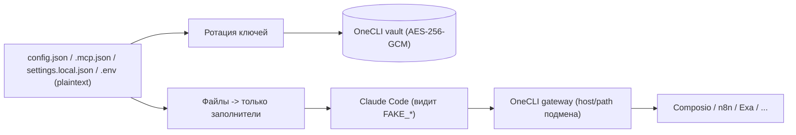

# 04 — Миграция секретов и данных

## Часть 1 — Секреты (срочно + системно)

### Что и где сейчас лежит в открытую
- **Bot-токен** — [`config.json`](/opt/workspace/config.json) (`telegram.bot_token`) и `~/.claude/channels/telegram-<user>/.env` (`TELEGRAM_BOT_TOKEN`).
- **Composio API-key** — [`.mcp.json`](/opt/workspace/.mcp.json) (`headers.x-api-key`).
- **n8n JWT** — зашит в правила `permissions.allow` в [`.claude/settings.local.json`](/opt/workspace/.claude/settings.local.json) (несколько `curl -H "X-N8N-API-KEY: <jwt>"`).
- **Прочие** — в `.env`: `ELEVENLABS_API_KEY`, `OPENROUTER_API_KEY`, `N8N_API_KEY`, `DATA_DB_PASSWORD`, ключ Exa.

### Немедленно: ротация (считать скомпрометированными)
Эти значения присутствуют в снимке прототипа в репозитории, поэтому **все они подлежат ротации до/в процессе миграции**, независимо от перехода на OneCLI:
1. Перевыпустить: bot-токены (BotFather), Composio key, n8n JWT/API-key, Exa, ElevenLabs, OpenRouter, пароль БД.
2. Новые значения класть **только** в OneCLI vault, не в файлы.
3. Старые — отозвать.

> Нюанс бесшовности: перевыпуск **bot-токена** разрывает текущий поллинг. Поэтому ротацию bot-токена делать **в момент cutover** пользователя (см. [05-runbook](05-seamless-cutover-runbook.md), шаг переключения), а не заранее. Остальные ключи (Composio/Exa/n8n/…) можно ротировать раньше — они не влияют на канал Telegram.

### Разделение платформенных и пользовательских секретов
В прототипе всё свалено в общие файлы. При переносе в OneCLI разделяем по владению:
- **Платформенные** (общие для флота): bot-токены, платформенный ключ Composio, ключ Exa, инфраструктурные креды. Управляются платформой, привязки scoped по host/path.
- **Пользовательские**: личные ключи/токены пользователя и его собственные MCP. Привязаны к onecli-токену конкретного пользователя, не видны другим тенантам.

### Перенос в OneCLI
Для каждого секрета — привязка placeholder → реальное значение, ограниченная host (+path). Агент в песочнице видит только заполнители; реальные подставляются на egress гейтвеем OneCLI (сборка — [08](08-runtime-and-gateways.md)).

- `config.json`/`.env`: заменить реальные значения на заполнители; реальные — в vault.
- `.mcp.json`: `x-api-key` → заполнитель; OneCLI подставляет реальный на egress к `backend.composio.dev`.
- `settings.local.json`: убрать JWT из правил вовсе — переписать на обращение через onecli-привязку к `monacosolicitors.app.n8n.cloud` (а в идеале n8n-эскалации заменить на admin notifications control plane, см. [03-component-mapping.md](03-component-mapping.md)).
- Включить egress-firewall, иначе подмену можно обойти прямым запросом.

## Часть 2 — Данные и состояние (переносится бесшовно)

### Состояние Telegram-канала
Каталог `~/.claude/channels/telegram-<user>/`:
- `access.json` — **критично**: пейринг/allowlist/группы. Переносится 1:1 → пользователю не нужно повторно пейриться.
- `topics.json`, `placeholders.json` — переносятся; осиротевшие плейсхолдеры новый поллер плагина подчистит на старте (логика `flushOrphanedPlaceholders`).
- `inbox/` — вложения; переносятся или чистятся по политике.
- `.env` — НЕ переносим как есть: значения уходят в OneCLI, остаются заполнители.

### Контекст сессии / память
- `logs/session_*.txt` — это **tmux-захваты**, а не resumable-сессии Claude, поэтому нативный `--resume` их «не видит». Используем для **разового сидинга**: на первом старте новой сессии один раз вливаем хвост старого лога как стартовый контекст (одноразовая инъекция). **Дальше** контекст ведёт нативный `--resume`/`--continue`.
- `CLAUDE.md`, `feedback_*`, `reference_*` — переносятся; ревизируются те, что описывали старые костыли (например, «читать логи на рестарте» теряет смысл при `--resume`).

### Артефакты и рабочие файлы
- `skills/`, `docs/`, `~/work/*` — переносятся в песочницу как есть. При включении обмена — через сканеры (см. [12](12-artifacts-sharing.md)).

### Доступ к модели (Team seat пользователя)
- `~/.claude/.credentials.json` — это **OAuth-креденциал Team seat** конкретного пользователя (у каждого свой, не шарится). При переносе в контейнер у пользователя сохраняется **его** seat: либо переносим его `credentials.json`, либо выполняем заново `claude login` под его member-аккаунтом. Доступ роутится через LiteLLM (`ANTHROPIC_BASE_URL`). **Запрещено** копировать один `credentials.json` нескольким пользователям (ToS). Это не placeholder-секрет OneCLI — это аутентификация самого `claude`.

### Подключения интеграций (Composio OAuth)
- Существующие **OAuth-подключения Composio** пользователя (состояние `composio-connect`/`composio_callback.py`) — это не просто ключ, а заведённые connections. При миграции их нужно **сохранить/перепривязать** к новому callback-сервису control plane, иначе пользователь потеряет доступ к подключённым внешним сервисам и будет вынужден переподключаться. Проверить на cutover, что активные подключения работают через новый callback + egress-белый список.

### Метаданные платформы (бэкфилл Postgres)
- Недостаточно «статус → migrated». Для существующих пользователей при cutover **заполняются целевые сущности** (схема — [07](07-control-plane.md)): `users` (telegram_user_id, os_username, role, is_admin, status, approved_by), `subscriptions` (tier base/extended, valid_until, anthropic_seat), `containers` (id, state, лимиты, last_active_at), `sessions` (имя/claude_session_id/state), `secret_bindings` (placeholder/host/path), а `usage_records` начинают писаться из LiteLLM. Биллинг — вне скоупа, только статусы доступа.

## Чек-лист миграции на одного пользователя (секреты+данные)
- [ ] Сделан полный бэкап песочницы (`.claude/`, `~/work`) до cutover.
- [ ] Ротированы все НЕ-telegram ключи; реальные — в OneCLI, в файлах заполнители.
- [ ] Секреты разделены на платформенные и пользовательские.
- [ ] `access.json`, `topics.json`, память, `skills/`, `~/work` скопированы в новую песочницу.
- [ ] Привязки OneCLI настроены (Composio, Exa, n8n/прочее) и проверены на egress.
- [ ] OAuth-подключения Composio перепривязаны к новому callback и проверены.
- [ ] egress-firewall включён для новой песочницы.
- [ ] bot-токен ротируется/переносится в OneCLI в момент cutover (синхронно с переключением поллера).
- [ ] Заполнены целевые сущности Postgres (users/subscriptions/containers/sessions/secret_bindings); usage_records пишутся из LiteLLM.
- [ ] Проверено: пользователь остаётся «спаренным», контекст подхвачен.
