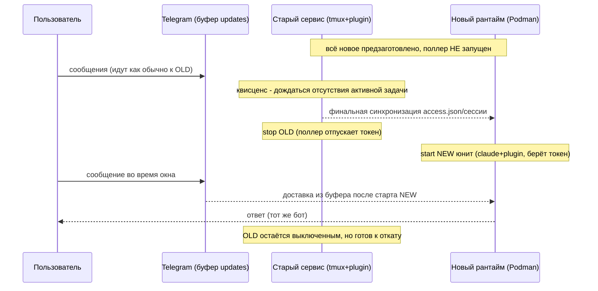

# 05 — Runbook: бесшовный перевод одного пользователя

Пошаговый перевод **одного** пользователя со старого стека (`claude-tg@<user>.service`) на новый контейнерный рантайм с нулевым простоем и возможностью отката. Выполняется по одному пользователю; остальные не затрагиваются.

## Ключевое ограничение и идея
Telegram допускает **ровно одного** потребителя `getUpdates` на bot-токен. Поэтому cutover — это короткая передача права поллинга: «погасить старый поллер → поднять новый». Пока ни один не поллит (секунды), Telegram **буферизует** входящие и доставит их новому поллеру. Bot-токен **остаётся тем же** → для пользователя это «тот же бот», без потери чата и пейринга.

## Предусловия
- Пройдена Фаза 0 (стабилизация) и Фаза 1 (control plane рядом): LiteLLM, OneCLI, образ контейнера, egress-firewall, аудит готовы.
- Не-telegram ключи пользователя уже ротированы и заведены в OneCLI ([04](04-secrets-and-data-migration.md)).

## Этап 1 — Подготовка нового рантайма (без влияния на пользователя)
Старый бот продолжает работать всё это время.
1. **Полный бэкап** песочницы пользователя (`.claude/`, `~/work`) — точка отката независимо от старого юнита.
2. Создать/подтвердить OS-учётку и rootless-Podman контейнер пользователя (эластичные лимиты `MemoryMax` + `CPUWeight`/`IOWeight`, nftables egress default-deny + белый список). Образ включает Bun и tmux (нужны официальному плагину).
3. Развернуть в контейнере: Claude Code, **официальный TG-плагин** (как канал основной сессии `claude`; самостоятельным демоном его не делаем — это потребовало бы патча), code-server, платформенные хуки (locked), shellfirm.
4. Прописать `ANTHROPIC_BASE_URL` на LiteLLM; завести виртуальный ключ/квоту пользователя.
5. Настроить OneCLI-привязки (Composio/Exa/n8n/прочее), перепривязать OAuth-подключения Composio к новому callback, проверить egress через гейтвей.
6. **Скопировать данные** (предварительно): `access.json`, `topics.json`, память (`CLAUDE.md`, `feedback_*`, `reference_*`), `skills/`, `~/work`, последний `session_*.txt`. См. [04](04-secrets-and-data-migration.md).
7. **Не запускать** канал/поллер (токен ещё у старого).
8. Прогнать smoke-тест нового рантайма с **тестовым** токеном (или в режиме без поллинга): Claude отвечает через LiteLLM, OneCLI подставляет секреты, shellfirm активен, **разовый сидинг** хвоста старого лога вливает контекст (нативный `--resume` подхватывает его уже как свою сессию на последующих стартах).

## Этап 2 — Квисценс (выбор окна)
1. Дождаться, что у пользователя **нет активной задачи** (плагин это видит: спиннер/`active`-сигнал в TUI; либо короткое окно без входящих).
2. (Опц.) тихо предупредить пользователя/выбрать ночное окно. Простоя для пользователя нет, но безопаснее переключать на паузе.
3. **Финальная синхронизация дельты**: старый сервис мог обновить `access.json` (новые пейринги) и логи — сделать финальный `rsync` этих файлов в новую песочницу непосредственно перед переключением.

## Этап 3 — Cutover (короткое окно, секунды)
1. `systemctl stop claude-tg@<user>.service` — старый поллер отпускает токен (плагин корректно завершает `getUpdates`, снимает `bot.pid`).
2. Перенести bot-токен в OneCLI и (если решено) ротировать; запустить **новый** юнит пользователя в контейнере (`claude` + официальный TG-плагин как канал, под watchdog-supervisor — без патча плагина) — он берёт токен и начинает поллинг.
3. Telegram отдаёт новому поллеру все буферизованные за окно апдейты — потерь нет.

> Если ротируете bot-токен: сделать это строго между шагами 1 и 2 (старый уже не поллит, новый ещё не стартовал) — иначе будет 409/расхождение.

## Этап 4 — Верификация
1. `getMe` нового поллера ок; в логах `polling as @<bot>`; нет 409.
2. Тестовое сообщение пользователя (или из админ-чата): приходит ответ; пользователь остаётся «спаренным» (`access.json` подхвачен).
3. Контекст подхвачен: первая сессия видит сидинг старого лога, далее `--resume` помнит прошлую сессию.
4. Проверки безопасности активны: shellfirm перехватывает, OneCLI подставляет, egress ограничен, tamper-resistant аудит пишет.
5. `claude -p` в терминале web-IDE **не роняет** канал (регрессионный тест Проблемы A).
6. OAuth-подключения Composio работают через новый callback.
7. Заполнить целевые сущности Postgres (users/subscriptions/containers/sessions/secret_bindings), статус → migrated; usage_records пишутся из LiteLLM.

## Этап 5 — Стабилизация и вывод старого
1. Наблюдать пользователя N дней (рестарты объяснимы, UX не деградировал, метеринг/аудит корректны).
2. Старый `claude-tg@<user>.service` держать **выключенным, но не удалённым** (горячий откат).
3. По истечении окна наблюдения — `systemctl disable` + архивировать старые данные пользователя, удалить юнит.

## Откат (на любом этапе до вывода старого)
1. Остановить новый юнит (claude+плагин) в контейнере (отпустить токен).
2. (Если ротировали токен — вернуть прежний или обновить старый сервис на новый токен.)
3. `systemctl start claude-tg@<user>.service` — старый поллер снова берёт токен.
4. Сверить `access.json` (если новый успел его изменить — слить пейринги обратно).
5. Зафиксировать инцидент в аудит, разобрать причину перед повторной попыткой.

## Массовый перевод (Фаза 5)
- Повторять runbook пачками по нескольку пользователей, между пачками — пауза на наблюдение.
- Приоритет: сначала «дружелюбные»/низкорисковые, в конце — самые активные.
- Скриптовать предзаготовку (Этап 1) и верификацию (Этап 4); cutover (Этап 3) — короткий и контролируемый.

## Риски и митигаторы
- **Потеря входящих в окне** → Telegram буферизует непрочитанные updates; окно — секунды; квисценс на паузе.
- **409 Conflict** → строгий порядок stop→(rotate)→start (старый поллер отпускает токен и снимает `bot.pid` до старта нового); watchdog не вмешивается в окне cutover.
- **Расхождение `access.json`** → финальная дельта-синхронизация прямо перед cutover; обратная сверка при откате.
- **Лимит seat пользователя в момент проверки** → проверять через LiteLLM (очередь/деградация вместо падения), не на пике.
- **Прерывание задачи** → квисценс по `active`-сигналу плагина; перенос контекста через `--resume`.
