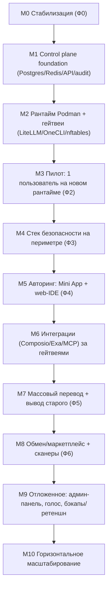

# 06 — Обзор доработки: от прототипа к целевой платформе

Этот и следующие документы (`07`–`13`) — **план разработки нового функционала** целевой платформы поверх живого прототипа Genesis (`/opt/workspace`). В отличие от `00`–`05` (механика перехода: стабилизация, секреты, бесшовный cutover), здесь — **что именно строить**: control plane, рантайм/гейтвеи, стек безопасности, Mini App + web-IDE, интеграции, обмен/маркетплейс, отложенное. Папка `migration/` самодостаточна: всё нужное для реализации описано здесь.

## Как этим пользоваться (исполнителю на сервере)
- Это **строительный план**, а не greenfield-спецификация. Не пересоздавай систему с нуля — **наращивай рядом** с работающими ботами и переключай пользователей по одному (см. [02-strategy-and-phases.md](02-strategy-and-phases.md), [05-seamless-cutover-runbook.md](05-seamless-cutover-runbook.md)).
- Каждый build-документ даёт: цель, что построить, структуру сервисов/модулей, библиотеки, формы API/схемы, точки интеграции, **критерии приёмки** и порядок.
- Build-документы — источник истины для реализации. Если что-то неоднозначно или не описано — не домысливай молча, зафиксируй вопрос и согласуй.

## Незыблемые ограничения (инварианты)
1. **In-place, без массовых перезапусков.** Новое поднимается рядом; старые `claude-tg@<user>.service` живут до перевода.
2. **Bot-токен пользователя не меняется** (ключ бесшовности).
3. **Официальный TG-плагин не патчим** (см. [01](01-stabilization-hotfixes.md), [03](03-component-mapping.md)).
4. **Доступ к модели — Anthropic Team, seat на пользователя**, за LiteLLM (см. [08](08-runtime-and-gateways.md)). **Несущее допущение:** маршрут подписочного OAuth-seat через `ANTHROPIC_BASE_URL`→LiteLLM **не доказан** (LiteLLM заточен под API-ключи) — подтверждается **блокирующим спайком до M2** (см. ниже и [08](08-runtime-and-gateways.md)).
5. **Секреты — только OneCLI + egress default-deny.** В файлах песочницы — заполнители.
6. **Аудит вне контейнера, append-only.** Любое решение шлюзов/ключей/сканеров журналируется.
7. **Автономность:** авто-шлюзы решают всё; админ — уведомления/fallback и авто-suspend.
8. **Границы тенанта и авторинга совпадают:** Claude Code и web-IDE работают над одними файлами песочницы.

## Целевой стек (фиксируем для всех воркстримов)
- **Control plane:** TypeScript/Node, монорепо (pnpm workspaces). HTTP — **Fastify**; очереди/воркеры — **BullMQ** (Redis). ORM — **Drizzle** (Postgres). Валидация — **zod**. Логи — **pino**.
- **Хранилища:** **PostgreSQL** (метаданные платформы), **Redis** (очереди, эфемерная маршрутизация, rate-limit, pub/sub), **append-only audit store** (отдельно), объектное хранилище (S3-совместимое: MinIO на MVP).
- **Рантайм пользователя:** **rootless Podman** контейнер на OS-учётку; per-user systemd template-unit; `tmux` + `Bun` (для офиц. плагина) + `claude` + `code-server` + хуки.
- **Гейтвеи:** **LiteLLM** (Python proxy, virtual keys) для модели; **OneCLI** (Rust gateway + Next.js dashboard) для секретов.
- **Сеть:** **nftables** per-container egress default-deny + белый список; контролируемый DNS-резолвер.
- **Reverse proxy:** **Caddy** (авто-HTTPS) с forward-auth к control plane → маршрутизация к per-user `code-server` и Mini App backend.
- **Mini App:** **React + TypeScript + Vite**, `@telegram-apps/sdk` (initData), UI — Telegram UI kit/Tailwind, websocket для live.
- **web-IDE:** `code-server` (по инстансу на контейнер) + VS Code-расширение Claude Code.
- **Безопасность:** shellfirm, Cisco mcp-scanner, skill-scanner, AgentShield, Promptfoo; **Judge Orchestrator** (наш сервис-обёртка над LLM-as-judge).

## Раскладка на сервере (предлагаемая)
```text
/opt/workspace/         # существующий прототип (старый стек) — НЕ трогаем массово
/opt/control-plane/     # новый монорепо control plane (git)
  apps/
    api/                # Mini App backend + публичный API
    provisioner/        # создание/suspend/удаление тенантов
    registry/           # реестр/маркетплейс артефактов
    judge-orchestrator/ # обёртка LLM-as-judge
    audit-collector/    # append-only приёмник аудита (unix socket + WORM)
    notifier/           # admin notifications / fallback
    miniapp/            # React/TS фронтенд (build → статіка за Caddy)
  packages/
    db/                 # Drizzle-схема + миграции
    shared/             # zod-контракты, типы, клиенты
    scanners/           # обёртки mcp/skill/agentshield/promptfoo
/opt/gateways/
  litellm/              # config.yaml + compose/unit
  onecli/               # gateway + dashboard
/opt/runtime/
  image/                # Containerfile образа пользователя + хуки (locked)
  systemd/              # template-units контейнера, watchdog
  nftables/             # шаблоны egress-правил
/srv/audit/             # WORM/append-only хранилище аудита
```

## Мастер-последовательность (майлстоуны)
Майлстоуны идут поверх фаз из [02](02-strategy-and-phases.md). Каждый — с гейтом приёмки.



- **M0** — [01-stabilization-hotfixes.md](01-stabilization-hotfixes.md). Гейт: `claude -p` не роняет канал, рестарты объяснимы, лимиты памяти.
- **M1** — [07-control-plane.md](07-control-plane.md). Гейт: Postgres-схема развёрнута, API/initData-авторизация работает, audit-collector принимает и хранит неизменяемо.
- **Спайк S1 (между M1 и M2, БЛОКИРУЮЩИЙ)** — доказать на одном тестовом seat, что подписочный **OAuth-seat ходит через LiteLLM** (`ANTHROPIC_BASE_URL`→LiteLLM с форвардом OAuth) и что **метеринг per-user снимается**. На этом маршруте висят и метеринг, и «лечение рестартов по лимиту», поэтому **до M2**. Детали, критерий go и fallback — [08-runtime-and-gateways.md](08-runtime-and-gateways.md). При no-go — M2 строится на fallback-варианте.
- **M2** — [08-runtime-and-gateways.md](08-runtime-and-gateways.md). Предусловие: **спайк S1 пройден** (или зафиксирован fallback). Гейт: образ собирается; тестовый контейнер с egress default-deny ходит в модель только через LiteLLM (или fallback-прокси), секреты — через OneCLI.
- **M3** — [05-seamless-cutover-runbook.md](05-seamless-cutover-runbook.md). Гейт: один реальный пользователь бесшовно переведён, откат проверен.
- **M4** — [09-security-stack.md](09-security-stack.md). Гейт: shellfirm/locked-settings/egress/аудит активны у мигрированных; Judge Orchestrator отвечает с кэшем.
- **M5** — [10-authoring-miniapp-ide.md](10-authoring-miniapp-ide.md). Гейт: пользователь правит `.claude/` через Mini App и web-IDE; аппрувы/стрим/мультисессии работают.
- **M6** — [11-integrations.md](11-integrations.md). Гейт: Composio OAuth и Exa работают через callback/белый список; пользовательский MCP проходит Scanner-гейт.
- **M7** — [02](02-strategy-and-phases.md) Ф5. Гейт: все переведены, старый стек выведен.
- **M8** — [12-artifacts-sharing.md](12-artifacts-sharing.md). Гейт: публикация/импорт с обязательными сканами и агентскими PR.
- **M9/M10** — [13-deferred-and-scaling.md](13-deferred-and-scaling.md).

> **Уточнение порядка исполнения (2026-06-16, решение Vitaliy).** Номера майлстоунов
> НЕ меняются (чтобы не путать уже идущую историю «M7 = массовый перевод», под которой
> переведён Дмитрий — коммиты + память). Меняется только **порядок выполнения**:
> **M8 (обмен/маркетплейс) делается ДО завершения M7 (массовый перевод остальных ботов).**
> Обоснование: M8 — платформенная фича, её дешевле построить и обкатать на 2 тенантах, уже
> на платформе (vitaliy + dmrudenko), чем сперва мигрировать весь флот и докручивать обмен
> после. Жёсткой зависимости нет: фундамент M8 частично готов (WorkflowBuilder M5.9; сканеры
> M5.5/AgentShield), net-new — только registry, GitHub-org PR-пайплайн, публикация/импорт,
> UI маркетплейса. Эффективный порядок: …M6 → **M8** → (добивка M7: остальные 6 ботов) → M9/M10.

## Сквозные правила разработки
- Всё новое пишет в **append-only аудит** через сокет audit-collector.
- Любой LLM-as-judge — **только через Judge Orchestrator** (без прямых вызовов из сканеров).
- **LLM-вызовы — только событийные** (save/publish/import, изменение guardian-промпта/версии модели). **Никаких рекуррентных/по-расписанию прогонов** (в т.ч. Promptfoo); дедуп и single-pass — через Judge Orchestrator.
- Платформенный слой `settings.json` — **locked**; пользовательский — через AgentShield-гейт.
- Каждая фича сперва включается **только для мигрированных** пользователей (флаг тенанта), не трогая старый стек.
