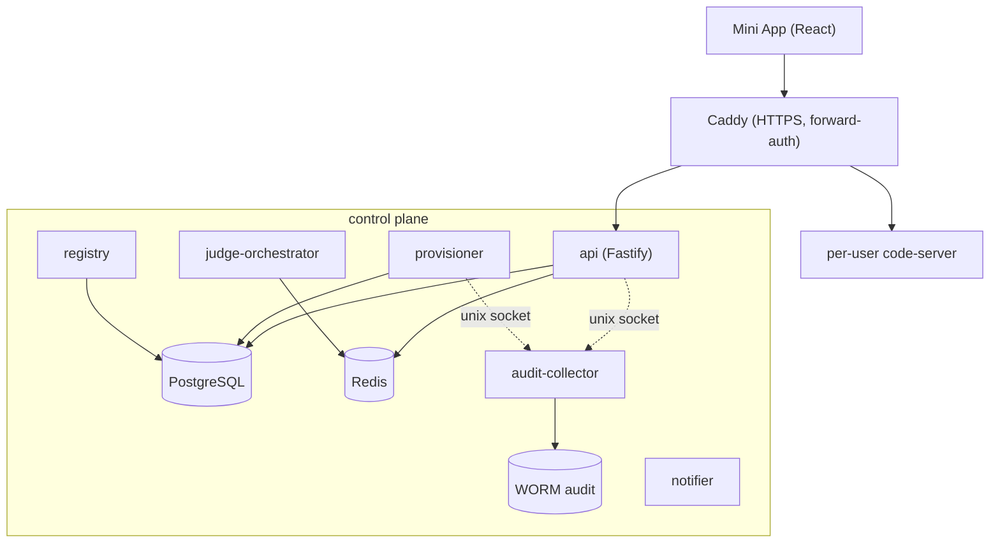

# 07 — Control plane (фундамент)

Майлстоун **M1**. Фундамент: центральные сервисы control plane и модель данных платформы (Postgres/Redis/аудит).

Control plane — центральные сервисы вне пути сообщений Telegram. Это фундамент: без него нельзя ни провижинить контейнеры, ни авторизовать Mini App, ни писать аудит. Строится **рядом** с прототипом, на тех же пользователей не влияет.

## Состав сервисов (монорепо `/opt/control-plane`)
- **api** — Mini App backend + публичный API (Fastify). `initData`-авторизация, эндпоинты билдеров/реестра/аудита/расхода/сессий/аппрувов.
- **provisioner** — создание/suspend/восстановление/удаление тенантов (OS-учётка + Podman + scaffold `.claude/` + выдача bot/onecli токенов + Team seat). См. [08](08-runtime-and-gateways.md).
- **registry** — реестр/маркетплейс артефактов. См. [12](12-artifacts-sharing.md).
- **judge-orchestrator** — единая обёртка LLM-as-judge. См. [09](09-security-stack.md).
- **audit-collector** — append-only приёмник (unix socket + WORM-хранилище).
- **notifier** — admin notifications/fallback (замена n8n-эскалаций прототипа).
- **miniapp** — React/TS фронтенд (build → статика за Caddy). См. [10](10-authoring-miniapp-ide.md).

Общие пакеты: `packages/db` (Drizzle + миграции), `packages/shared` (zod-контракты, типы, клиент аудита), `packages/scanners` (обёртки сканеров).



## PostgreSQL — схема (Drizzle / DDL)
Полная схема метаданных платформы. Пример на SQL (Drizzle-миграция эквивалентна):

```sql
CREATE TYPE user_status   AS ENUM ('provisioned','active','idle','suspended','deleted');
CREATE TYPE sub_tier      AS ENUM ('base','extended');
CREATE TYPE artifact_type AS ENUM ('skill','subagent','command','mcp','workflow','plugin');
CREATE TYPE scanner_kind  AS ENUM ('mcp','skill','agentshield','promptfoo');
CREATE TYPE verdict_kind  AS ENUM ('pass','fail','error');

CREATE TABLE users (
  id              uuid PRIMARY KEY DEFAULT gen_random_uuid(),
  telegram_user_id bigint UNIQUE NOT NULL,
  os_username     text UNIQUE NOT NULL,
  role            text,
  is_admin        boolean NOT NULL DEFAULT false,
  status          user_status NOT NULL DEFAULT 'provisioned',
  approved_by     uuid REFERENCES users(id),
  created_at      timestamptz NOT NULL DEFAULT now()
);

CREATE TABLE subscriptions (
  user_id        uuid PRIMARY KEY REFERENCES users(id) ON DELETE CASCADE,
  tier           sub_tier NOT NULL,
  status         text NOT NULL,             -- active/expired/...
  valid_until    timestamptz,
  anthropic_seat text                       -- ссылка на member/seat Team (один на пользователя)
);

CREATE TABLE containers (
  user_id      uuid PRIMARY KEY REFERENCES users(id) ON DELETE CASCADE,
  container_id text,
  state        text NOT NULL,               -- running/paused/stopped
  cpu_weight   int, cpu_quota int, mem_high bigint, mem_max bigint,
  last_active_at timestamptz
);

CREATE TABLE sessions (
  id               uuid PRIMARY KEY DEFAULT gen_random_uuid(),
  user_id          uuid REFERENCES users(id) ON DELETE CASCADE,
  session_name     text NOT NULL,
  claude_session_id text,
  state            text NOT NULL,           -- active/idle/closed
  started_at       timestamptz NOT NULL DEFAULT now(),
  last_message_at  timestamptz
);

CREATE TABLE artifacts (
  id            uuid PRIMARY KEY DEFAULT gen_random_uuid(),
  owner_user_id uuid REFERENCES users(id),
  type          artifact_type NOT NULL,
  name          text NOT NULL,
  visibility    text NOT NULL DEFAULT 'private'  -- public/private/selective
);

CREATE TABLE artifact_versions (
  id          uuid PRIMARY KEY DEFAULT gen_random_uuid(),
  artifact_id uuid REFERENCES artifacts(id) ON DELETE CASCADE,
  version     text NOT NULL,
  git_ref     text, provenance jsonb, published_at timestamptz
);

CREATE TABLE scan_results (
  id                 uuid PRIMARY KEY DEFAULT gen_random_uuid(),
  artifact_version_id uuid REFERENCES artifact_versions(id) ON DELETE CASCADE,
  scanner            scanner_kind NOT NULL,
  verdict            verdict_kind NOT NULL,
  severity           text, report_ref text, judge_cache_hit boolean,
  created_at         timestamptz NOT NULL DEFAULT now()
);

CREATE TABLE installs (
  user_id            uuid REFERENCES users(id) ON DELETE CASCADE,
  artifact_version_id uuid REFERENCES artifact_versions(id),
  installed_at       timestamptz NOT NULL DEFAULT now(),
  pinned_version     text,
  PRIMARY KEY (user_id, artifact_version_id)
);

CREATE TABLE usage_records (
  id      bigserial PRIMARY KEY,
  user_id uuid REFERENCES users(id) ON DELETE CASCADE,
  window  text, tokens bigint, compute numeric, model text,
  ts      timestamptz NOT NULL DEFAULT now()
);

CREATE TABLE secret_bindings (
  id          uuid PRIMARY KEY DEFAULT gen_random_uuid(),
  user_id     uuid REFERENCES users(id) ON DELETE CASCADE,
  placeholder text NOT NULL, host text NOT NULL, path text,
  injection   jsonb               -- метаданные; реальные значения — в onecli vault
);

CREATE TABLE audit_index (   -- только индекс; сами записи — в WORM-хранилище
  id        bigserial PRIMARY KEY,
  user_id   uuid, kind text, ref text, ts timestamptz NOT NULL DEFAULT now()
);
```

## Redis — назначение
- **BullMQ-очереди:** провижининг, сканирование, fair-use, фоновые задачи.
- **Эфемерная маршрутизация Mini App / web-IDE** — короткоживущие сессионные токены.
- **Rate-limit счётчики** — Judge Orchestrator, гейтвеи.
- **Pub/sub** — «live activity» (`PostToolUse` → websocket Mini App).

## Сервис `api` — ключевые эндпоинты
`initData`-авторизация: middleware проверяет HMAC `initData` (бот-секрет), достаёт `telegram_user_id`, грузит `users`. Контракты — zod в `packages/shared`.

```text
POST /auth/session            # обмен initData → краткоживущий JWT (Redis)
GET  /me                      # профиль, tier, статус
# Песочница / авторинг
GET  /fs/tree?path=           # дерево .claude/ песочницы (read)
GET  /fs/file?path=           # содержимое файла
PUT  /fs/file                 # сохранить (→ прогон сканеров перед записью, см. 09/12)
# Билдеры
POST /build/subagent          # форма → .claude/agents/<name>.md (+ raw)
POST /build/mcp               # форма → запись в .mcp.json (→ MCP Scanner)
POST /build/workflow          # граф → компиляция в commands/+agents/ (см. 12)
# Реестр/маркетплейс
GET  /registry/items          # каталог
POST /registry/publish        # публикация (→ сканеры → агентский PR)
POST /registry/import         # импорт (→ повторный скан → установка)
# Расход / сессии / аппрувы
GET  /usage                   # дашборд (из LiteLLM)
GET  /sessions  POST /sessions/:id/switch
GET  /approvals  POST /approvals/:id/(approve|deny)
# Live
WS   /live                    # PostToolUse-события из Redis pub/sub
```

## Сервис `audit-collector` (tamper-resistant)
- Слушает **unix socket** (`/run/audit/collector.sock`), доступный сервисам control plane и хукам контейнера (через bind-mount только на запись).
- Каждая запись: `{ts, user_id, kind, actor, payload, prev_hash, hash}` — **hash-chain** (каждая запись хеширует предыдущую) → подделка/удаление обнаруживаются.
- Хранилище: append-only файлы в `/srv/audit` (WORM-режим: `chattr +a`/иммутабельный бакет), индекс — в `audit_index`.
- Пользователь и его контейнер **не имеют доступа на чтение/изменение** хранилища; только запись через сокет.

## Деплой (на том же сервере, рядом с прототипом)
- Каждый сервис — systemd-юнит (`cp-api.service`, `cp-provisioner.service`, …), `Restart=always`, логи в journald + аудит.
- Postgres/Redis — системные сервисы или контейнеры (на MVP — нативно).
- Caddy — фронт: HTTPS, forward-auth к `api`, маршрутизация `/(app|api)` → control plane, `/<user>/ide` → per-user code-server (см. [10](10-authoring-miniapp-ide.md)).
- Миграции БД — `drizzle-kit`, запуск из CI/деплой-скрипта.

## Критерии приёмки (M1)
- Postgres-схема развёрнута, миграции идемпотентны.
- `POST /auth/session` валидирует `initData` и выдаёт JWT; `/me` отдаёт профиль.
- `audit-collector` принимает записи, hash-chain верифицируется, пользователь не может изменить хранилище.
- Сервисы стартуют как systemd-юниты, не влияют на работающие `claude-tg@*`.
