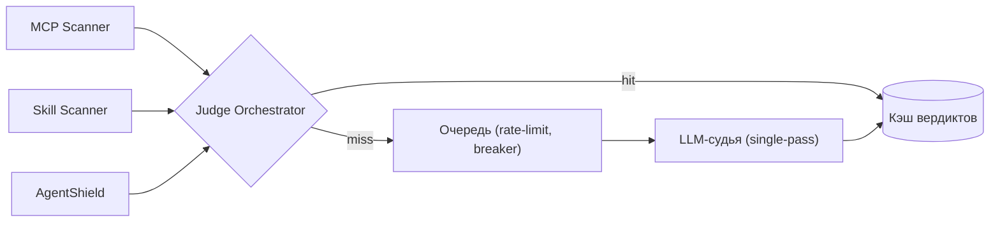

# 09 — Стек безопасности (6 уровней + Judge Orchestrator + аудит)

Майлстоун **M4** (базовый периметр), сканеры обмена — **M8**. Реализует 6 уровней защиты + Judge Orchestrator + tamper-resistant аудит.

Включается **для мигрированных** пользователей. Две оси: предотвращение (6 уровней внутри тенанта) и containment (изоляция из [08](08-runtime-and-gateways.md)). Здесь — предотвращение.

## Уровень 1 — Намерения хранителя
- Реализация: guardian-системный промпт + `CLAUDE.md` + политики `permissions`/`deny` в **платформенном (locked)** `settings.json`.
- Эскалация на установку кода/MCP/навыка → авто-запуск L4–L6 (без человека).
- Перенос из прототипа: хуки `telegram-track-chat.sh`, `telegram-block-askuser.sh` сохраняются (askuser эволюционирует в inline-аппрувы, [10](10-authoring-miniapp-ide.md)).

## Уровень 2 — shellfirm (опасные команды)
- Установка в образ; `shellfirm connect claude-code` ставит `PreToolUse`-хук (+ MCP-инструменты).
- Перехват каждой Bash-команды до выполнения — одинаково для агента и для терминала web-IDE.
- Critical → auto-deny + безопасная альтернатива; решение → в аудит (JSON-lines + audit-collector).

## Слоистый `settings.json`
- **Платформенный слой (locked)** — в образе, read-only: security-хуки (shellfirm, маршрутизация onecli, запись аудита), deny-list, привязка к LiteLLM. Пользователь не может отключить.
- **Пользовательский слой (`settings.local.json`)** — свои хуки/разрешения/плагины **только после AgentShield-гейта** (L6).
- Сервис применения: при изменении `settings.local.json` (через Mini App/web-IDE) — прогон AgentShield; fail → откат.

## Уровни 4–6 — сканеры артефактов (через Judge Orchestrator)
`packages/scanners` — обёртки, вызываемые на save/publish/import:
- **L4 MCP Scanner** (`cisco-ai-defense/mcp-scanner`): YARA + LLM-as-judge + prompt-defense. Любой fail → MCP не подключается.
- **L5 Skill Scanner** (`cisco-ai-defense/skill-scanner`): YARA + behavioral dataflow (AST) + LLM-as-judge. Без pass — навык/субагент/команда/плагин не ставится.
- **L6 AgentShield** (изменения `.claude/`): hardcoded-секреты, права, hook-injection, prompt-injection → откат. **Promptfoo** — red-team против хранителя **по событию**: при изменении guardian/системного промпта или смене версии модели, **не по расписанию** (соблюдаем правило «ноль рекуррентных LLM-вызовов»).
- Claude Code Plugins (хуки/код/MCP) проходят **все три** сканера.

## Judge Orchestrator (сервис `judge-orchestrator`)
Требование ТЗ: без холостых и зацикленных вызовов. Единственная точка LLM-as-judge.

```text
POST /judge   { artifact_hash, kind, content_ref, ruleset_version }
  -> 200 { verdict: pass|fail|error, severity, cache_hit, report_ref }
```

Механика:
- **Контент-хеш дедупликация** — одинаковый артефакт не судится дважды.
- **Кэш вердиктов** (Redis/Postgres) с TTL и инвалидацией по версии правил/модели.
- **Single-pass** — одна оценка на артефакт, без итеративных доуточнений.
- **Очередь (BullMQ) + rate-limit + circuit breaker** при деградации судьи.
- **Запрет рекурсии/самопроверок** — судья не инициирует вложенный судейский вызов (флаг контекста).
- **Бюджетный потолок** на проверку (стоп при превышении).



## Tamper-resistant аудит
- Все решения (shellfirm, использования onecli, вердикты сканеров, откаты AgentShield, провижининг, эскалации) → в `audit-collector` (см. [07](07-control-plane.md)): unix socket, hash-chain, WORM, недоступно пользователю на запись/удаление.

## Автономность и авто-suspend
- Штатный поток без человека: L1 → авто L4–L6 → L2–L3 авто-deny/подмена → L4–L5 авто-вердикт → L6 авто-откат + Promptfoo по событию (изменение guardian-промпта/версии модели).
- **Авто-suspend** контейнера (`podman pause`/stop + нотификация через `notifier`) при повторных зловредных попытках/ошибке сканера/злоупотреблении квотами. Блокирующего человеческого аппрува нет; админ — уведомления/fallback.

## Порядок включения (для мигрированного пользователя)
1. Образ уже несёт locked-слой + shellfirm (из [08](08-runtime-and-gateways.md)).
2. Включить запись решений в аудит, проверить egress default-deny.
3. Поднять `judge-orchestrator`; подключить сканеры на save/publish/import.
4. Включить AgentShield-гейт на пользовательский слой настроек.
5. Подключить Promptfoo как **event-триггер**: прогон против guardian-промпта при каждом его изменении (и при смене версии модели), без рекуррентных прогонов по расписанию.

## Критерии приёмки (M4)
- shellfirm блокирует деструктив у мигрированных (и в терминале web-IDE).
- Пользователь не может отключить платформенные хуки/deny-list.
- Judge Orchestrator: повтор того же артефакта — `cache_hit=true`, без второго вызова судьи; circuit breaker срабатывает при деградации.
- Аудит неизменяем, hash-chain верифицируется.
- Авто-suspend срабатывает и уведомляет админа.
