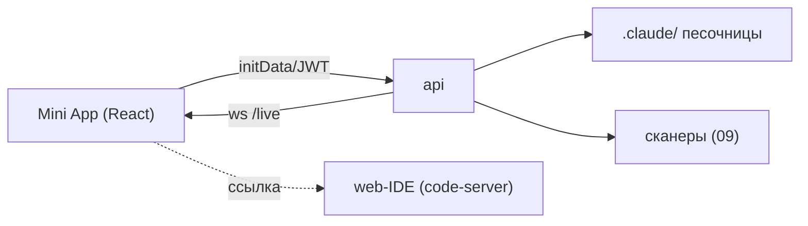

# 10 — Авторинг: Telegram Mini App + web-IDE

Майлстоун **M5**. Плоскость «100% контроля» над артефактами `.claude/`: структурный авторинг (Mini App) + полный нативный опыт (web-IDE) + закрытие пробелов паритета.

Это плоскость «100% контроля»: пользователь правит **точные байты** файлов `.claude/` без LLM-прослойки. Две поверхности: **Mini App** (структурный авторинг) и **web-IDE** (полный нативный опыт). Прототип такого не имеет — строим с нуля, но поверх уже мигрированной песочницы.

## Telegram Mini App (`apps/miniapp`, React + TS + Vite)
- **Авторизация:** `@telegram-apps/sdk` отдаёт `initData` → `POST /auth/session` ([07](07-control-plane.md)) проверяет HMAC → JWT.
- **Транспорт:** REST к `api` + websocket `/live`.
- **UI:** Telegram UI kit / Tailwind.

Экраны/модули (каждый — на API из [07](07-control-plane.md)):
- **FileTree** — дерево песочницы `.claude/` (read/edit) с diff (`/fs/tree`, `/fs/file`).
- **Структурные билдеры** (форма + обязательный **raw view**):
  - `SubagentBuilder` → `.claude/agents/<name>.md` (`name/description/tools/model` + system prompt).
  - `McpBuilder` → запись в `.mcp.json` (→ MCP Scanner до подключения).
  - `WorkflowBuilder` → граф из субагентов/скиллов → компиляция в `commands/`+`agents/` (см. [12](12-artifacts-sharing.md)).
- **ScanResults** — инлайн-вердикты Skill/MCP Scanner + AgentShield перед save/publish.
- **Marketplace** — обзор/импорт/публикация (PR делает агент, [12](12-artifacts-sharing.md)).
- **UsageDashboard** — расход из LiteLLM (замена нативным `/cost`,`/usage`).
- **SessionsManager** — именованные сессии/проекты, переключение (`/sessions`).
- **ApprovalsQueue** — очередь аппрувов (`AskUserQuestion`/permission) с inline-кнопками.
- **LiveActivity** — `PostToolUse`-события через websocket (стрим действий).
- **FilePicker** — выбор файла → вставка `@path` (замена нативным `@`-упоминаниям).



## Per-user web-IDE (code-server)
- **Один инстанс на контейнер** пользователя (границы изоляции совпадают; рантайм — [08](08-runtime-and-gateways.md)).
- **Полный терминал включён** (под shellfirm/onecli/egress) → можно запустить нативный `claude` прямо здесь = максимальный паритет.
- В образе — `claude` CLI + **VS Code-расширение Claude Code** (inline-диффы, аппрувы).
- **Доступ:** Caddy reverse-proxy с **forward-auth** к `api` → маршрут `/<user>/ide` к нужному code-server; привязка к Telegram-аккаунту через краткоживущий токен (Redis).

```text
Caddy: route /<user>/ide/*  -> forward_auth /api/auth/ide?user=<user> -> code-server:8080 контейнера
```

## Закрытие пробелов паритета с нативным Claude Code
- **Аппрувы / `AskUserQuestion`:** `PreToolUse`-хук рендерит запрос как inline-клавиатуру Telegram и/или кладёт в `ApprovalsQueue` Mini App; в headless — блок + зеркало (как в прототипе).
- **Живой стрим:** `PostToolUse` → Redis pub/sub → websocket `LiveActivity`; либо `tmux attach`/TUI в web-IDE.
- **Checkpoints / rewind:** таймлайн сессии в Mini App (нативные чекпоинты) + через web-IDE.
- **Мультисессии/проекты:** менеджер именованных сессий (tmux-окна/папки), переключение из Telegram/Mini App; мультифолдер в web-IDE.
- **Личный GitHub пользователя:** через Composio-коннектор или onecli-инжектируемый токен ([11](11-integrations.md)).
- **Фоновые задачи/нотификации:** раннер фоновых задач (BullMQ) + Telegram-нотификации (заменяет cron прототипа, см. [13](13-deferred-and-scaling.md)).

## Поток сохранения артефакта (детерминированно)
1. Пользователь правит файл в Mini App/web-IDE.
2. `PUT /fs/file` → прогон сканеров ([09](09-security-stack.md)) перед записью.
3. pass → запись в `.claude/`; fail → отказ + причина инлайн.
4. Запись в аудит.

## Порядок реализации
1. `api`-эндпоинты `fs/*`, `build/*`, `sessions`, `approvals`, ws `/live` (M1 уже дал каркас).
2. Mini App: auth → FileTree → билдеры → ScanResults.
3. web-IDE: образ уже несёт code-server (M2); поднять Caddy forward-auth + маршрут.
4. Аппрувы (inline + очередь), затем LiveActivity, затем мультисессии/чекпоинты/FilePicker.

## Критерии приёмки (M5)
- Пользователь из Telegram открывает Mini App (initData-auth) и **детерминированно** правит `.claude/` с diff.
- Билдеры создают валидные субагент/MCP/workflow с raw view; сканеры показывают вердикт до сохранения.
- web-IDE открывается по reverse-proxy с привязкой к аккаунту; терминал под shellfirm; нативный `claude` запускается.
- Аппрув из Telegram (inline) разблокирует/блокирует инструмент; live-activity видна.
