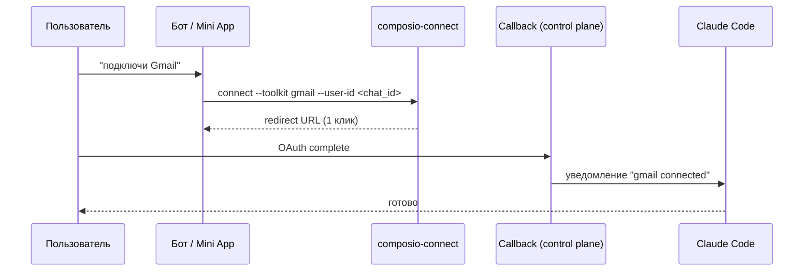

# 11 — Интеграции: Composio, Exa, пользовательские MCP

Майлстоун **M6**. Интеграции по умолчанию (Composio, Exa) и пользовательские MCP — с ключами в OneCLI, callback в control plane, egress в белом списке.

Концепция переносится из прототипа, но ключи уходят в OneCLI, egress — в белый список, callback — в control plane. Включается для мигрированных пользователей.

## Composio (backbone внешних сервисов)
- Подключается как MCP tool-router в `.mcp.json` (`composio` с tool-router URL); ключ Composio — **платформенный секрет** в OneCLI (не в `.mcp.json`, как было в прототипе).
- **OAuth-флоу подключения сервиса** (Gmail, Drive, Slack, …):

- **Callback-сервис** — эндпоинт control plane (часть `api`): `GET /integrations/composio/callback` принимает редирект, привязывает connection к `user_id`, уведомляет сессию (через канал/Mini App).
- **Хелпер `composio-connect`** — в образе контейнера (как в прототипе), печатает redirect-URL; `composio_callback.py`/`composio-proxy` заменяются callback-сервисом + egress-белым списком.
- **Изоляция:** пользовательские OAuth-подключения скоупятся по `user_id`; auth-config toolkit'а бутстрапится один раз на флот.
- **Миграция существующих подключений:** перепривязать активные connections к новому callback (см. [04](04-secrets-and-data-migration.md)) — иначе пользователь потеряет доступ.
- **UX-правило (из прототипа):** не говорим «Composio/OAuth/MCP» — «подключу Gmail».

## Exa (интернет-ресёрч)
- Используется как skill/инструмент и для фоновых задач (как `ai_digest` прототипа).
- Ключ Exa — **платформенный секрет** в OneCLI; в прототипе он инлайнился в `.mcp.json` — **исправляем**: заполнитель в конфиге, подмена на egress к `mcp.exa.ai`.

## Пользовательские MCP-серверы
- Пользователь добавляет свой MCP через Mini App/web-IDE (`McpBuilder`, [10](10-authoring-miniapp-ide.md)).
- **Обязательный шлюз:** Cisco MCP Scanner (L4, [09](09-security-stack.md)) до подключения. Fail → не подключается.
- Egress такого MCP — через onecli/белый список; произвольный egress запрещён.

## Egress-врезка
Все внешние вызовы (Composio backend, Exa, пользовательские MCP) — через гейтвеи/белый список nftables ([08](08-runtime-and-gateways.md)); прямой произвольный egress закрыт.

## Порядок реализации
1. Завести ключи Composio/Exa в OneCLI как платформенные; заполнители в образе.
2. Реализовать callback-эндпоинт в `api` + проверить полный OAuth-цикл на тестовом тенанте.
3. Добавить Composio backend и `mcp.exa.ai` в белый список egress.
4. Подключить MCP Scanner-гейт к `McpBuilder`.
5. Перепривязать существующие Composio-подключения мигрируемых пользователей.

## Критерии приёмки (M6)
- «Подключи Gmail» → рабочий OAuth через новый callback; connection скоупнут по пользователю.
- Exa-ресёрч работает с заполнителем в конфиге (реальный ключ только на egress).
- Пользовательский MCP подключается лишь после pass MCP Scanner.
- Прямой egress мимо гейтвеев невозможен (default-deny держит).
