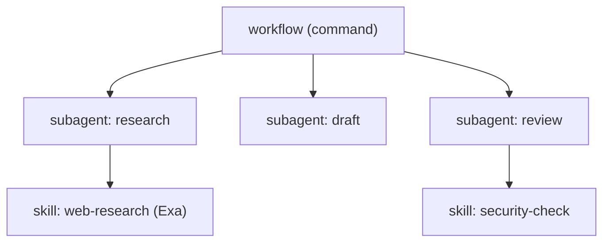

# 12 — Артефакты, композиция, обмен и маркетплейс

Майлстоун **M8**. Артефакты как нативные файлы `.claude/`, нативная композиция workflow, реестр/маркетплейс и опосредованный обмен через GitHub с обязательными сканами.

Артефакты — это **нативные файлы** `.claude/`. Поэтому их можно детерминированно править ([10](10-authoring-miniapp-ide.md)), сканировать ([09](09-security-stack.md)) и обменивать через GitHub как есть.

## Типы артефактов (нативные примитивы)
- **Skill** — `.claude/skills/<name>/SKILL.md` (+ `scripts/`). Совместим со Skill Scanner. (Пример прототипа: `skills/uk-tourist-visa/`.)
- **Subagent** — `.claude/agents/<name>.md` (frontmatter + system prompt).
- **Slash-команда** — `.claude/commands/<name>.md`.
- **MCP-сервер** — запись в `.mcp.json` (только через MCP Scanner-гейт).
- **Память/правила** — `CLAUDE.md`, `feedback_*`, `reference_*`, `role_templates` (переносятся из прототипа).
- **Хуки/Plugins** — через AgentShield-гейт; платформенные хуки залочены.

## Workflow — нативная композиция (вариант A) + компилятор
У Claude Code нет примитива «workflow» — это наш конструкт. **Только нативная композиция** (без n8n на MVP).

- **Workflow** = оркестрирующая slash-команда/субагент, последовательно вызывающая субагентов + скиллы.
- **Компилятор** (`packages/shared` + эндпоинт `POST /build/workflow`): граф из `WorkflowBuilder` ([10](10-authoring-miniapp-ide.md)) → нативные файлы `commands/<wf>.md` + `agents/*.md`. Портируемо, шарится через GitHub, понятно сканерам, 100% контроль.



## Реестр / Marketplace (сервис `registry`)
Каталог общих артефактов (Postgres: `artifacts`, `artifact_versions`, `scan_results`, `installs`, см. [07](07-control-plane.md)).
- Метаданные: автор, версия, тип, статус сканов, провенанс.
- **Версионирование и пиннинг** — импорт фиксирует конкретную версию.
- **Видимость:** public / private / selective (открытый параметр).
- Зеркало/кэш в объектном хранилище (MinIO) + `git_ref` в общей GitHub-org.

```text
GET  /registry/items?type=&visibility=
POST /registry/publish   { artifact_id, version }   # → сканеры → агентский PR → запись версии
POST /registry/import    { artifact_version_id }    # → повторный скан → установка в песочницу
```

## GitHub: общая org, PR делает агент
- **Общая организация GitHub** для флота; артефакт — нативные файлы (версионирование Git).
- **Все PR создаёт и ревьюит сам агент** и публикует от имени флота (пользователь не пушит напрямую).
- Токен GitHub-org — платформенный секрет в OneCLI.

## Поток публикации (детерминированно)
1. Пользователь жмёт «опубликовать» в Mini App.
2. Обязательные сканы (Skill/MCP Scanner + AgentShield) через Judge Orchestrator; вердикты → аудит. Fail → стоп + причина.
3. Pass → агент создаёт PR в общую org, ревьюит, мёржит; версия + провенанс → реестр.

## Поток импорта (детерминированно)
1. Выбор артефакта в Mini App → control plane тянет зафиксированную версию из реестра/GitHub.
2. **Повторный скан** под актуальные правила (каждый импорт пересекает границу доверия).
3. Pass → установка файлов в `.claude/` песочницы (`installs`); fail → отказ + причина.
4. Запись в аудит.

## Плагины (повышенный риск)
Claude Code Plugins (хуки/код/MCP) — самый рискованный класс: **все три сканера** + AgentShield; платформенные security-хуки остаются залоченными после установки.

## Порядок реализации
1. Workflow-компилятор + `build/workflow`.
2. Сервис `registry` + сущности Postgres + объектное зеркало.
3. GitHub-org + агентский PR/review-пайплайн (токен в OneCLI).
4. Публикация/импорт с обязательными сканами (переиспользуют [09](09-security-stack.md)).
5. UI маркетплейса в Mini App ([10](10-authoring-miniapp-ide.md)).

## Критерии приёмки (M8)
- Workflow из билдера компилируется в валидные `commands/`+`agents/`.
- Публикация без pass сканеров невозможна; PR создаёт агент, провенанс в реестре.
- Импорт делает повторный скан и ставит зафиксированную версию; fail → отказ с причиной.
- Все вердикты — в неизменяемом аудите.

## Открытые вопросы
- Подписи артефактов (sigstore/GPG) — MVP или позже.
- Модель видимости по умолчанию и «поделиться выборочно».
