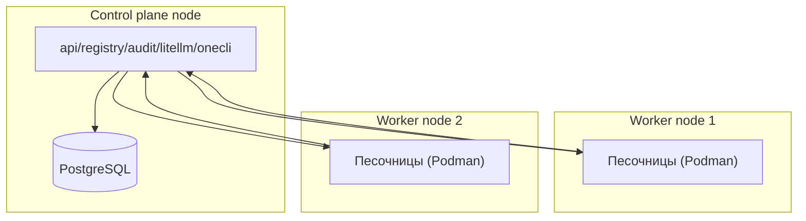

# 13 — Отложенное: админ-панель, голос, бэкапы/ретеншн, масштабирование

Майлстоуны **M9** (отложенные фичи) и **M10** (масштабирование).

Реализуется после массового перевода ([02](02-strategy-and-phases.md), Ф5) и стабильного MVP. Не блокирует основной поток, но входит в полный охват целевой архитектуры.

## Админ-панель (M9)
- **Отдельное приложение** (не Mini App): suspend/восстановление, аудит-просмотр, вайтлист/одобрение пользователей, управление общими секретами, метрики расхода/здоровья.
- Бот администратора при этом **идентичен пользовательскому**; привилегии — на уровне control plane/ОС, а не в боте.
- Стек: React/TS поверх того же `api` (ролевой доступ `is_admin`), отдельный маршрут за Caddy + сильная аутентификация.
- Источник данных: уже существующие `audit_index`/WORM, `usage_records`, `containers`, `users`.

## Голос (ElevenLabs STT/TTS) (M9)
- Переносится как пользовательский навык/инструмент; ключ ElevenLabs — платформенный секрет в OneCLI, egress в белый список.
- Входящие голосовые Telegram → STT → промпт; ответы → TTS (по расписанию дорожной карты). В прототипе уже было — реактивируем поверх нового рантайма.

## Фоновые задачи и нотификации (M9)
- **Раннер фоновых задач** (BullMQ в control plane или per-user systemd-таймеры в контейнере) заменяет root-cron прототипа (дневные отчёты, блог, `ai_digest`, `vfs_monitor`).
- Задачи исполняются под shellfirm/OneCLI/egress, как любая агентная работа; результаты → Telegram-нотификации.

## Бэкапы, объектное хранилище, ретеншн (M9)
- **Объектное хранилище** (MinIO/S3): зеркало артефактов/версий, бэкапы песочниц, отчёты сканеров (`report_ref`).
- **Бэкапы песочниц:** периодический бэкап `~/work` и `.claude/`; шифрование на месте (открытый вопрос).
- **Ретеншн жизненного цикла**: Suspended → хранение N дней → Deleted; аудит — долгий ретеншн (комплаенс/доверие к автономии). Число дней — открытый вопрос, зафиксировать политику.

## Горизонтальное масштабирование (M10)
Когда одного сервера мало:

- **Шардирование пользователей по воркер-нодам** (пользователь привязан к ноде; bot-токен и сессии следуют за ним).
- Control plane (Postgres, реестр, аудит, гейтвеи) — централизован/реплицируется (HA — открытый вопрос).
- Контейнерная модель уже переносима: песочница мигрируема на любую ноду.
- **Оркестратор** — открытый вопрос: голый Podman+systemd на нодах vs Kubernetes/Nomad.
- Стратегия миграции песочницы между нодами (live vs cold) — открытый вопрос.

## Эксплуатация (сквозное)
- **Автономность:** авто-шлюзы решают всё; админ — уведомления/fallback.
- **Обновления:** новый базовый образ (Claude Code, расширение, хуки) → перекат контейнеров; правила сканеров — централизованно; новые системные промпты — через Promptfoo до выката.
- **Мониторинг:** аудит + метрики LiteLLM + здоровье контейнеров (systemd/Podman).

## Критерии приёмки
- **M9:** админ-панель управляет пользователями/аудитом/секретами; голос работает; фоновые задачи на новом раннере (cron хоста выведен); бэкапы и политика ретеншна заданы.
- **M10:** пользователь привязан к ноде, сессии/токен следуют за ним; control plane централизован; задокументирован выбор оркестратора и стратегия переноса песочниц.

## Открытые вопросы
- Политика ретеншна (дни) Suspended→Deleted; шифрование бэкапов.
- WORM-бэкенд аудита (отдельная БД/бакет).
- Оркестратор и HA control plane при масштабировании.
- Подписи артефактов; модель видимости по умолчанию.
- Автоматизация выдачи/отзыва Team seat при провижининге/suspend.
